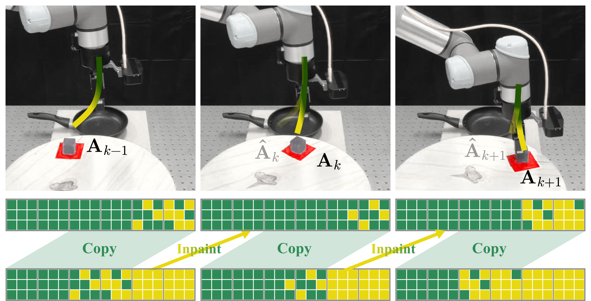
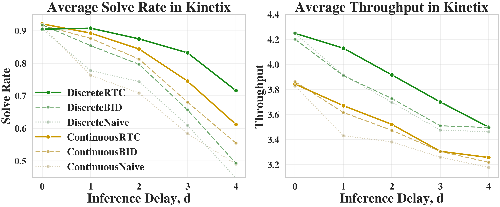
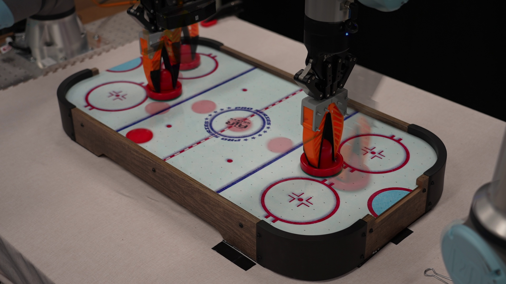
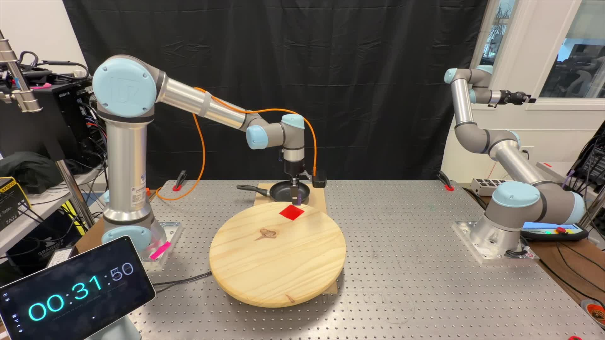

<div align="center">

# DiscreteRTC: Discrete Diffusion Policies are Natural Asynchronous Executors

**Pengcheng Wang**<sup>1</sup> · **Kaiwen Hong**<sup>2</sup> · **Chensheng Peng**<sup>1</sup> · **Katherine Driggs-Campbell**<sup>2</sup> · **Masayoshi Tomizuka**<sup>1</sup> · **Chenfeng Xu**<sup>3</sup> · **Chen Tang**<sup>4</sup>

<sup>1</sup>UC Berkeley · <sup>2</sup>UIUC · <sup>3</sup>UT Austin · <sup>4</sup>UCLA

[](https://arxiv.org/abs/2604.25050)
[](https://outsider86.github.io/DiscreteRTCSite/)
[](https://github.com/starVLA/starVLA)
[](https://github.com/outsider86/DiscreteRTC/tree/kinetix)
[](https://github.com/outsider86/DiscreteRTC/tree/real)

</div>

<p align="center">
  
</p>

> **Figure 1.** Async execution with discrete diffusion policies. During each inference cycle, a discrete diffusion policy copies the tail of the last action chunk as the committed prefix and inpaints upon it by simply forwarding itself. Compared with flow-matching inpainting that relies on ΠGDM, discrete-diffusion inpainting is **simpler to implement, faster at inference, and better at execution.**

---

## TL;DR

Flow-matching–based real-time chunking (RTC) is ill-suited for asynchronous execution due to four critical limitations. By replacing the action head with a **discrete diffusion policy**, all of them are resolved at once.

> **Discrete diffusion policies are natural asynchronous executors.**

| | |
|---|---|
| **0 lines of code** | to implement inpainting-specific inference for async execution |
| **~0.7× inference cost** | vs. ~1.7× for flow-matching–based RTC |
| **+65% success rate** | on real-world Hockey Defend vs. flow-matching RTC (65% vs. 0%) |

---

## Abstract

Unlike chatbots, physical AI must act while the world keeps evolving. The inter-chunk pause of synchronous executors is fatal for dynamic tasks — regardless of how fast inference is. Asynchronous execution — *thinking while acting* — is therefore a structural requirement, and real-time chunking (RTC) makes it viable by recasting chunk transitions as inpainting: freezing committed actions and consistently generating the rest.

However, RTC with a flow-matching policy is structurally suboptimal: its inpainting comes from inference-time corrections rather than the base policy, yielding little pre-training benefit, requiring specific fine-tuning and heuristic guidance weights, and adding extra computation that inflates latency.

We observe that **discrete diffusion policies**, which generate actions by iteratively unmasking, are **natural asynchronous executors that resolve all limitations at once**: they are fine-tuning free since inpainting is their native operation, while early stopping further provides adaptive guidance and reduces inference cost. We propose **DiscreteRTC**, which replaces external corrections with native unmasking, and show on dynamic simulated benchmarks and real-world dynamic manipulation tasks that it achieves higher success rates than continuous RTC and other baselines — while being simpler to implement, faster at inference, and better at execution.

---

## Why flow-matching is not suited for RTC

RTC was designed for flow-matching action heads, yet RTC with a flow-matching head has four critical limitations, all from one root cause: *the inpainting capability comes from inference-time correction (e.g., ΠGDM), not the base policy.*

| | Flow-matching RTC (limitation) | Discrete diffusion (resolved) |
|---|---|---|
| **a** | Pre-training without inpainting | Inpainting *is* the pre-training task |
| **b** | Dedicated fine-tuning required | Fine-tuning free |
| **c** | Heuristic, fixed guidance schedule | Natural, adaptive guidance via early-exit |
| **d** | Extra inference cost (VJP, ~1.7×) | Lower inference cost (~0.7×) |

---

## Results

### Simulated benchmark — Kinetix

Across inference delays, DiscreteRTC consistently beats ContinuousRTC and other baselines on both **solve rate** and **throughput** (each datapoint averages 2,048 trials; baselines share the same architecture, differing only in the action head / async strategy).

<p align="center">
  
</p>

> **Figure 2.** Average solve rate (left) and throughput (right) vs. inference delay on Kinetix. Discrete variants (RTC / BID / Naive) degrade far more gracefully than their continuous counterparts as delay grows.

### Real-world dynamic manipulation

We validate DiscreteRTC on a UR5e + Robotiq gripper with a wrist-mounted RGB camera on a single RTX 4090, across three reactiveness-stress tasks: **Dynamic Pick**, **Dynamic Place**, and **Hockey Defend**. On the most demanding task, Hockey Defend, synchronous baselines and flow-matching ContinuousRTC **completely fail (0%)**, while DiscreteRTC succeeds — empirically reaffirming that *discrete diffusion policies are natural asynchronous executors.*

<p align="center">
  
  
</p>

> **Figure 3.** Real-world setups — Air Hockey Defend (left) and Dynamic Pick & Place (right).

> 🎥 Full rollout videos and interactive figures are on the [**project page**](https://outsider86.github.io/DiscreteRTCSite/).

---

## Repository guide

This repository is organized into **three branches**:

| Branch | Purpose |
|---|---|
| **`main`** *(here)* | Project overview, key result plots, and guidance to the other branches. |
| [**`kinetix`**](https://github.com/outsider86/DiscreteRTC/tree/kinetix) | **Simulation pipeline.** Full Kinetix reproduction code — expert training, data generation, discrete diffusion / flow policy training, and evaluation across inference delays. |
| [**`real`**](https://github.com/outsider86/DiscreteRTC/tree/real) | **Real-world experiments infrastructure** for the UR5e dynamic manipulation tasks (Dynamic Pick, Dynamic Place, Hockey Defend). |

---

## ⭐ Use and extend DiscreteRTC in StarVLA

DiscreteRTC is **intentionally lightweight** — the core method is essentially *a call*, not a heavy framework. The per-branch code here reproduces the paper's experiments, but if you want to **build on, extend, or apply DiscreteRTC**, we strongly encourage you to use our actively maintained implementation in **StarVLA**, where we keep it up to date:

### 👉 https://github.com/starVLA/starVLA

---

## Citation

```bibtex
@article{wang2026discreterc,
  title         = {DiscreteRTC: Discrete Diffusion Policies are Natural Asynchronous Executors},
  author        = {Wang, Pengcheng and Hong, Kaiwen and Peng, Chensheng and
                   Driggs-Campbell, Katherine and Tomizuka, Masayoshi and
                   Xu, Chenfeng and Tang, Chen},
  journal       = {arXiv preprint},
  year          = {2026}
}
```
